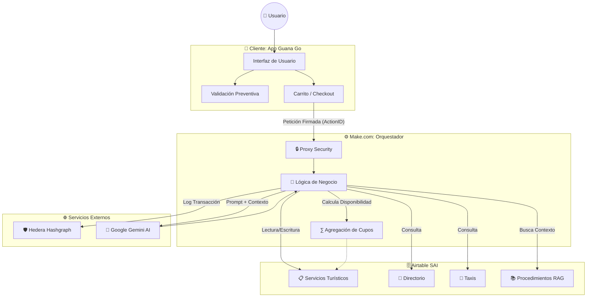
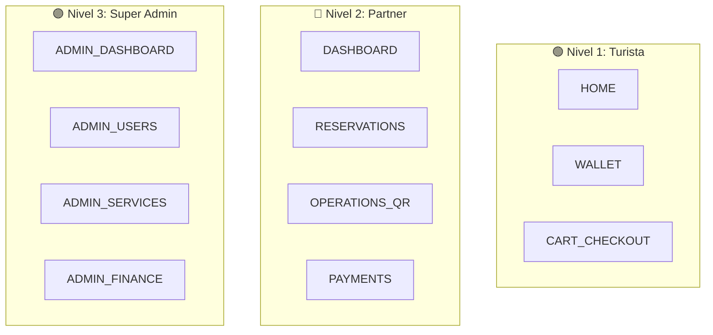

# 🗺️ Guana Go: Arquitectura Técnica Pro (V3.0)

## 📐 Diagrama de Arquitectura (Sistema)

## 🧠 1. El Cerebro (Data Flow - Proxy Security)
Para garantizar la integridad y seguridad, la App no se conecta directamente a Airtable.
1. **App**: Envía peticiones firmadas con un `actionID` a **Make.com**.
2. **Make.com (Proxy)**: 
   - Inyecta las API Keys de forma segura.
   - Realiza cálculos de agregación (ej: sumar cupos ocupados).
   - Registra transacciones en el Ledger de Hedera.
3. **Tablas Reales (Airtable SAI)**:
   - `ServiciosTuristicos SAI`: Maestro de tours, precios y capacidad.
   - `Directorio SAI`: Comercios y restaurantes para el buscador.
   - `Taxis SAI`: Tarifas oficiales por zona.
   - `Procedimientos Rag`: Base de conocimiento para el asistente IA.

## 📦 2. Sistema de Inventario y Cupos
El inventario es dinámico y se calcula en el servidor (Make) bajo esta lógica:
- **Disponibilidad** = `Capacidad_Diaria` - `Cupos_Ocupados`.
- **Validación Preventiva**: El DatePicker bloquea fechas donde `Disponibilidad <= 0`.
- **Atomicidad**: Al confirmar pago, el flujo Make suma `personas_reservadas` al campo `Cupos_Ocupados` inmediatamente.

## 🤖 3. Inteligencia Artificial (RAG Logístico)
El Chatbot "Guana" utiliza **Retrieval-Augmented Generation**:
- **Query**: El mensaje del usuario se envía a Make.
- **Contexto**: Make busca en la tabla `Procedimientos Rag` palabras clave (cancelación, seguro, mora).
- **Prompt**: El modelo (Gemini) recibe el texto del SOP oficial como "Base de Verdad" antes de responder.

## 📍 4. Estructura de Navegación y Rutas

### 🟢 Nivel 1: Turista (público)
- `HOME`: Buscador (Directorio SAI) y Categorías de Tours.
- `MAP`: **[SUSPENDIDO TEMPORALMENTE]** Se muestra placeholder informativo.
- `WALLET`: Gestión de tokens $GUANA y fidelización.
- `CART/CHECKOUT`: Flujo de reserva con notarización Hedera.

### 🔵 Nivel 2: Partner (Operador Verificado)
- `DASHBOARD`: Métricas de ventas y acceso a servicios.
- `RESERVATIONS`: Lista de clientes con control de estado (Confirmar/Cancelar).
- `OPERATIONS`: Escáner QR para canje de servicios en muelle/hotel.
- `PAYMENTS`: Historial de liquidaciones y saldo para reventa.

### 🟣 Nivel 3: Super Admin
- `ADMIN_DASHBOARD`: Salud del sistema (Usuarios totales, Ingresos COP).
- `ADMIN_USERS`: Aprobación manual de nuevos operadores.
- `ADMIN_SERVICES`: Control de calidad y visibilidad del catálogo global.
- `ADMIN_FINANCE`: Auditoría de canjes de tokens y pagos.

## ⚠️ 5. Nota sobre Mapas y Geolocalización
La integración con **Mapbox GL JS** y la API de **Geolocalización** nativa del navegador han sido suspendidas en esta versión para optimizar el rendimiento inicial y simplificar el flujo de despliegue. Se planea su reactivación en la V4.0 mediante desarrollo en entorno local (Visual Studio).

## 🛡️ 6. Blockchain (Auditoría Inmutable)
Toda reserva confirmada genera un registro en **Hedera Network**.
- El usuario recibe un `transactionID` verificable en **HashScan**.

### MCP groq
[ NÚCLEO CENTRAL: EL CEREBRO GUANA GO (Groq + Lógica Raizal) ] | |-- 1. INFRAESTRUCTURA TÉCNICA (El Chasis) | |-- Groq API: Procesamiento de lenguaje a velocidad ultra-rápida. | |-- Render: Servidor puente (MCP) para conectar el cerebro con el mundo. | |-- Make.com: El sistema nervioso que automatiza acciones. | L-- Airtable: La memoria a largo plazo y base de conocimiento. | |-- 2. MEMORIA DINÁMICA (El Diferencial) | |-- Compresión de Contexto: Resúmenes inteligentes en Airtable. | |-- Historial de Socio/Turista: La IA "recuerda" preferencias sin saturarse. | L-- Base de Datos No-Estática: El inventario aprende de la demanda real. | |-- 3. CANALES DE IMPACTO (Los Tentáculos) | |-- B2C (Turista): | | |-- Cotización instantánea 24/7 (Cierre de venta). | | L-- Paquetes personalizados (Ruta Raizal + Souvenir). | |-- B2B (Aliados/Empresarios): | | |-- Onboarding automático via Bot. | | L-- Gestión de Membresías (Bronce/Plata/Oro). | L-- INTERNO (Oficina/Inversores): | |-- Integración Google Workspace (Drive, Gmail, Calendar). | L-- Generación de reportes de tracción automáticos. | |-- 4. MODELO DE MONETIZACIÓN (El Motor Económico) | |-- Comisión por Venta: Tours y Alojamientos. | |-- SaaS (Software as a Service): Membresías para empresarios. | |-- Publicidad Geo-Localizada: Pauta en Mapbox + Recomendación IA. | L-- Guana Points: Tokenización de la fidelidad del turista. | |-- 5. VALOR ESTRATÉGICO (La IP para el Inversor) |-- Independencia de Plataforma: Funciona en VS Code, Web y App. |-- Eficiencia Operativa: Reducción del 70% en personal administrativo. |-- Propiedad de Datos: La inteligencia de mercado es 100% tuya. L-- Escalabilidad: De San Andrés a PriceTravel (Global) en un clic.